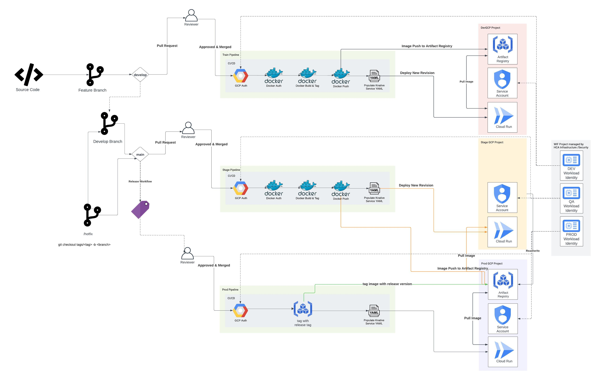

# Continuous Integration & Continuous Deployment for Cloud Run
This repository is designed to lint code, scan code and deploy packaged code to Cloud Run. It manages the promotion process from development to production through pull requests and releases while also allowing for canary deployments through workflow dispatch. 

Here is a highlevel visualization of the workflow

## Deploying to DEV 
1. Create a new feature branch from main, make necessary changes to your code. 
2. Raise a pull request from your new feature branch to develop. 
3. When the pull request is raised, the workflow will lint the code to ensure quality and CodeQL will scan the code to ensure there are no vulnerabilities in the code, a docker container is build and wiz.io will scan it. 
4. Once merged, the image would be built and pushed to Artifact Registry in the Google Cloud project used for development.
5. In develop, once the image is built, it will immediately be deployed to Cloud Run as a new revision in the development project. 

## Deploying to QA 
1. Raise a pull request from develop to main. This will trigger a scan workflow similar to develop
2. Once develop is merged to main, the image is built and pushed to the **production** Artifact Registry repository. The reason this is done is to test the image in QA, then re-tag the image for use in production if QA testing is sucessful in a promote fashion. 
3. Once the image is pushed to the production Artifact Registry, Cloud Run will pull the image and deploy it to the QA Google Cloud project. 

## Canary Deployments to Production 
1. Go to the Google Cloud console to retrieve the existing revision name. 
2. Go to the workflow named *Canary Deployment to Cloud Run* to trigger the workflow from workflow dispatch. 
3. Insert the existing revision name into the field named *Old Revision Name* and set the traffic split so it adds up to 100%. Feel free to do this a few times to gradually rollout the new revision, increasing the traffic to the new revision each time. 
4. In the console, you can see the new revision will have the URL tag *blue* and the old revision will have the URL tag *green*. This can be used to see which users hit each revision or to have users test the new revision by using the revision URL. 

## Deploying to Production
1. Create a [GitHub Release](https://docs.github.com/en/repositories/releasing-projects-on-github/managing-releases-in-a-repository) to trigger a new production deployment. Once the release is published, the workflow will be triggered. 
2. This environment should have approvals on the workflow, so approvers will need to approve before the image build and before the Cloud Run deployment. 
3. This workflow will re-tag the image with the release tag and will deploy 100% of traffic to the new revision. 

